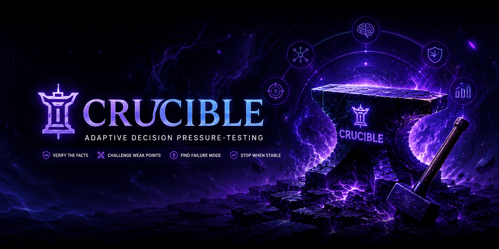

<div align="center">



# Crucible

### Adaptive Decision Pressure-Testing for Claude Code

[](https://crucible.smshahbaj.com)
[](LICENSE)
[](https://github.com/smshahbaj/crucible)
[](https://smshahbaj.com)
[](https://crucible.smshahbaj.com)

> *"More reasoning is not automatically better. The right amount of reasoning is better."*

</div>

---

## ⚡ Overview

**Crucible** is a second-opinion decision review skill and plugin for **Claude Code** built by [SM Shahbaj](https://smshahbaj.com). 

When making critical architectural choices, strategic proposals, code migrations, or security decisions, Crucible frames the real objective, verifies decision-critical evidence against codebase invariants, pressure-tests failure modes, compares alternative paths, and halts when additional computation will not change the chosen action.

Crucible **does not** turn every simple question into a verbose, multi-agent debate. Instead, it dynamically routes queries across **3 adaptive review depths** and **14 specialized agent lenses**, ensuring low-stakes tasks remain fast and lightweight while high-stakes decisions receive rigorous adversarial pressure-testing.

---

## 🚀 Quick Start & Installation

Crucible functions as both a native **Claude Code Plugin** (`.claude-plugin/plugin.json`) and a **Marketplace Registry** (`.claude-plugin/marketplace.json`). Zero external databases or API keys are required for standard plugin execution.

### Option A — Install from Marketplace (Recommended)

In your Claude Code session, run:

```text
/plugin marketplace add smshahbaj/crucible
/plugin install crucible@crucible-marketplace
```

Then pressure-test any decision:

```text
/crucible Pressure-test this decision before I commit: should we choose architecture A or B?
```

### Option B — Local Directory Checkout

Clone the repository locally and point Claude Code to the directory:

```bash
git clone https://github.com/smshahbaj/crucible.git ~/crucible
claude --plugin-dir ~/crucible
```

---

## 🎯 Adaptive Routing Depths

Crucible dynamically selects an execution depth based on **stakes, uncertainty, reversibility, and evidence needs**:

| Depth | Trigger Criteria | Lens Allocation | Mechanism |
| :--- | :--- | :--- | :--- |
| 🟢 **QUICK** | Low stakes, high reversibility, clear choices | **1 Lens** | Single-pass review. Rapid sanity check without multi-agent overhead. |
| 🟡 **REVIEW** | Moderate trade-offs, medium uncertainty | **2 Lenses** | Parallel multi-perspective evaluation probing trade-offs and edge cases. |
| 🔴 **DEEP** | High downside risk, irreversible, conflicting data | **3–5 Lenses** | Deep adversarial review with targeted codebase verification & pre-mortem analysis. |

---

## 🤖 The 14 Specialist Agents

Crucible routes tasks through specialized agent lenses to challenge assumptions without circular bloat:

| Specialist Agent | Core Responsibility |
| :--- | :--- |
| `claim-compressor` | Extracts and isolates atomic factual assertions from context. |
| `decision-router` | Evaluates stakes, reversibility, and assigns adaptive depth (QUICK, REVIEW, DEEP). |
| `decision-strategist` | Structures strategic trade-offs, opportunity costs, and long-term roadmaps. |
| `evidence-auditor` | Verifies claims against codebase invariants and empirical evidence. |
| `evidence-gate` | Subjects decision-critical assertions to strict validation gates. |
| `execution-specialist` | Audits implementation hurdles, migrations, and delivery feasibility. |
| `failure-analyst` | Conducts pre-mortem analysis hunting edge cases and cascading failures. |
| `final-judge` | Synthesizes specialist perspectives into an auditable recommendation. |
| `option-analyst` | Discovers and evaluates viable unstated alternative architectures. |
| `quality-controller` | Enforces stop-when-stable rules and convergence quality. |
| `quantitative-analyst` | Computes expected value, confidence bounds, and probabilistic risks. |
| `risk-red-team` | Adversarially probes blind spots, optimism biases, and vulnerabilities. |
| `source-auditor` | Audits open-source licenses, dependency health, and supply-chain safety. |
| `verification-planner` | Formulates concrete, falsifiable tests to validate assertions. |

---

## 🏛️ Architectural Pillars

1. **Anti-Anchoring**: Specialist lenses generate perspectives independently before synthesizing, preventing early leading conclusions from creating anchor bias.
2. **Evidence Gates**: Factual assertions are categorized into verified facts, unverified assumptions, and speculation. Only verified facts support critical decision paths.
3. **Failure-First Analysis**: Concentrates scrutiny on the single failure mode most capable of changing the chosen action.
4. **Counterfactual Pressure-Testing**: Explicitly defines what specific counter-evidence or changing assumption would flip the final recommendation.
5. **Stop-When-Stable**: Computation halts as soon as additional deliberation is unlikely to alter the output decision.

---

## 📖 Local Decision Ledger

Crucible includes an optional local, durable **Decision Ledger** stored in `.crucible/ledger.jsonl` to track choices, assumptions, and retrospective real-world outcomes over time.

### Record a Decision
```bash
python3 scripts/decision_ledger.py --add record.json --ledger .crucible/ledger.jsonl
```

### Render Decision Summary
```bash
python3 scripts/decision_ledger.py --render record.json
```

### Audit Ledger Report
```bash
python3 scripts/decision_ledger.py --report --ledger .crucible/ledger.jsonl
```

---

## ⚙️ System Requirements

- **Claude Code**: Installed and configured.
- **Python**: 3.10+ (only required for optional local ledger scripts and benchmark tools).
- **API Keys / DB**: None required for regular Claude Code plugin operation.

---

## 📄 License & Attribution

Crucible is open-source software released under the [MIT License](LICENSE).

Crafted with precision by **SM Shahbaj** ([@smshahbaj](https://x.com/smshahbaj)).
- Website: [https://smshahbaj.com](https://smshahbaj.com)
- Crucible Portal: [https://crucible.smshahbaj.com](https://crucible.smshahbaj.com)
- Email: [contact@smshahbaj.com](mailto:contact@smshahbaj.com)
